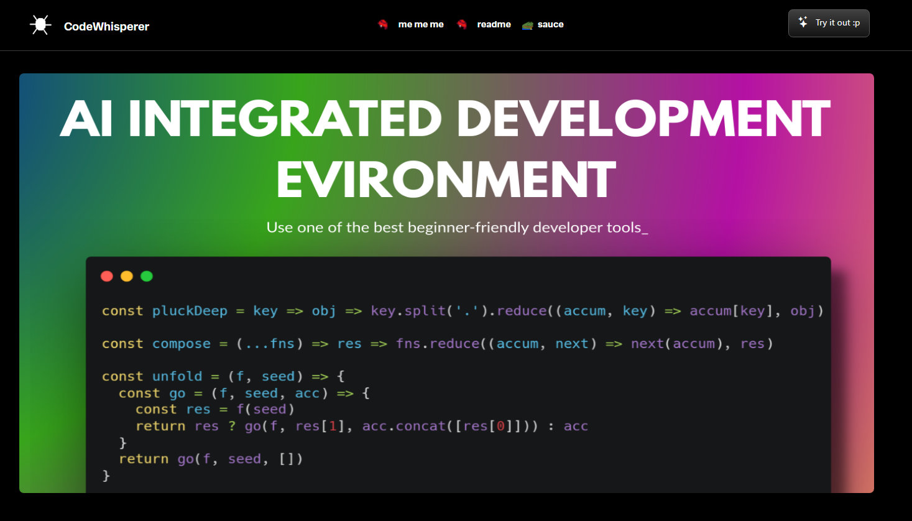

# 🌟 Presenting Code Whisperer :3


**A modern react + tailwind web powered by OpenRouter API for AI support.**

> ⚠️ *Work's in progress – some features(External Authentications and etc) are still under development.*

---



---

## 🚀 FEATURES

- ⚛️ **React.js** – Modular and interactive frontend
- 🎨 **Tailwind Styling** – Modern and sleek UI  (im still working on it T-T)
- 🤖 **AI-Powered Assistance** – Refactors, explains, analyzes code using OpenRouter (OpenAI API)  (theres more it btw ;p).
- 🗄 **Database** – Supabase (for user preferences and user-specific data).
- 🌐 **Hosting** – Vercel with free custom domain .
- ⚡ **Optimized & Fast** – Lightweight, minimal bundle size (YET)

---

## 🛠 Tech Stack

| Layer           | Technology              |
|-----------------|-------------------------|
| Frontend        | React.js + Tailwind CSS |
| AI / Backend    | OpenRouter API (OpenAI) |
| Database        |         Supabase        |
| Hosting         |          Vercel         |
| Version Control |          GitHub         |   

---

## 💻 GETTING STARTED
### 1. Clone the repository
```bash

git clone https://github.com/SukhdevThukral/code-whisperer
cd code-whisperer

```

### 2. Install dependencies

```bash

npm install

```

### 3. Run locally

```bash 

npm start

```

### 4. Build for production

```bash 

npm run build

```

---

### ⚙️ ENVIRONMENT VARIABLES
**Create your own .env file in the root and add your API keys (its already in .gitignore tho):**

```bash

VITE_OPENROUTER_KEY=your_openrouter_api_key
VITE_SUPABASE_URL=your_supabase_url
VITE_SUPABASE_KEY=your_supabase_key

```

---

### ⚠️ STATUS
Current implemented features:  
- Code explanation ✅  
- Comment generation ✅  
- Complexity analysis ✅
- Vulnerability check ✅
- Code Refactorisation ✅
- Python Support ✅

Features in progress / upcoming:
- External Auth 🕒  
- Auto-refactor suggestions 🕒  
- Multi-language "full" support 🕒 
- UI refinement🕒
- Personalized user dashboard 🕒

---

### 🌐 LIVE DEMO

[https://code-whisperer-plum.vercel.app/](https://code-whisperer-plum.vercel.app/)  
*(Hosted on Vercel)*

### 🙋‍♂️ AUTHOR

**Sukhdev Thukral**  
- Email: sukhdevthukral2411@gmail.com  
- GitHub: [https://github.com/SukhdevThukral](https://github.com/SukhdevThukral)  

---

### ⭐ CONTRIBUTING (i'd love if you do T-T)

1. Fork the repo.
2. Create a branch (pls) (`git checkout -b feature/my-feature`)
3. Commit changes (`git commit -m 'Add feature'`)
4. Push to the branch (`git push origin feature/my-feature`)  
5. Open a Pull Request  

---

MIT License – see [LICENSE](LICENSE) for details.
